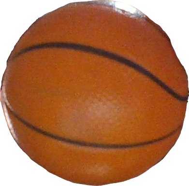

# Ball Tracking with OpenCV

Projeto acadêmico de visão computacional que identifica uma bola pela cor, acompanha seu movimento em vídeo e desenha a trajetória recente do objeto em tempo real.



## Demonstração

A apresentação e a execução do projeto estão disponíveis no [YouTube](https://youtu.be/4CUJade8Kb4).

## Como funciona

1. Captura frames da webcam ou de um arquivo de vídeo.
2. Redimensiona e suaviza a imagem com filtro Gaussiano.
3. Converte o frame do espaço BGR para HSV.
4. Cria uma máscara usando limites de cor configurados.
5. Aplica erosão e dilatação para reduzir ruídos.
6. Encontra o maior contorno e calcula seu centro.
7. Armazena as posições recentes e desenha a trajetória.

## Tecnologias

- Python
- OpenCV
- NumPy
- imutils

## Instalação

```bash
git clone https://github.com/Adrianozk/ball_tracking.git
cd ball_tracking

python -m venv .venv
source .venv/bin/activate
pip install -r requirements.txt
```

No Windows, ative o ambiente virtual com:

```powershell
.venv\Scripts\activate
```

## Calibração da cor

O script `range_detector.py` ajuda a descobrir os limites mínimo e máximo de RGB ou HSV adequados ao objeto e à iluminação do ambiente.

Com a webcam:

```bash
python range_detector.py --filter HSV --webcam --preview
```

Com uma imagem:

```bash
python range_detector.py --filter HSV --image image.png --preview
```

Após identificar os valores adequados, ajuste as variáveis `lower` e `upper` em `ball_tracking.py`.

## Execução

Usando a webcam:

```bash
python ball_tracking.py
```

Usando um vídeo:

```bash
python ball_tracking.py --video caminho/para/video.mp4
```

Alterando o tamanho do histórico usado para desenhar o rastro:

```bash
python ball_tracking.py --buffer 32
```

Pressione `q` para encerrar.

## Limitações

- A detecção depende da iluminação e do contraste entre o objeto e o ambiente.
- Os limites HSV estão definidos no código e podem exigir nova calibração.
- O rastreamento usa segmentação por cor, não um modelo de aprendizado de máquina.
- O projeto tem finalidade acadêmica e demonstrativa.

## Referência

A implementação foi desenvolvida com base no tutorial [Ball Tracking with OpenCV](https://pyimagesearch.com/2015/09/14/ball-tracking-with-opencv/), de Adrian Rosebrock, e adaptada para o trabalho acadêmico da equipe.

## Participantes

- Adriano Luís Fernandes
- João Gabriel Oliveira
- Victor Barbosa de Santana
- Luiz Gustavo Moreira de Oliveira
- Marcelo Pedroni
