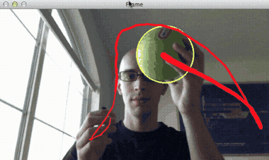
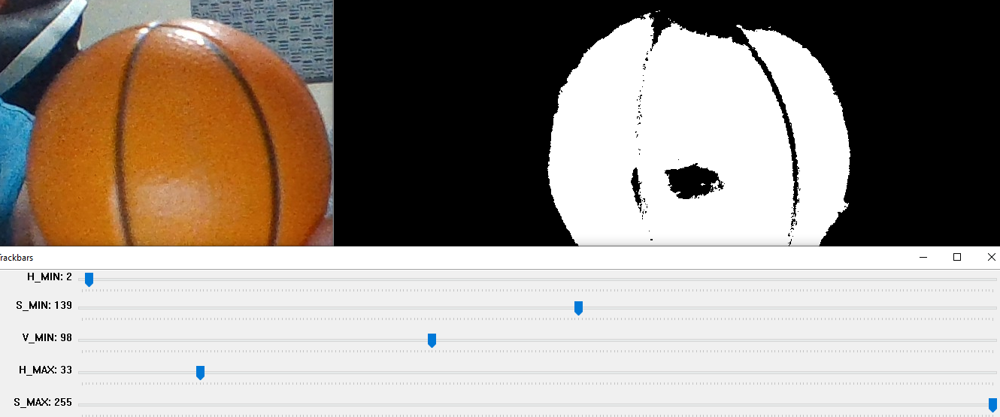
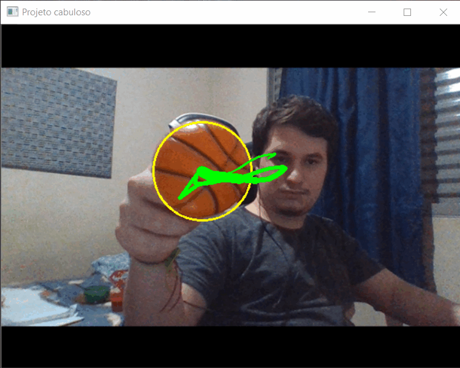

# Ball Tracking with OpenCV

Projeto acadêmico de visão computacional que identifica uma bola pela cor, acompanha seu movimento em vídeo e desenha a trajetória recente do objeto em tempo real.

## Demonstração

<p align="center">
  
</p>

A apresentação completa e a execução do projeto estão disponíveis no [YouTube](https://youtu.be/4CUJade8Kb4).

## Como funciona

1. Captura frames da webcam ou de um arquivo de vídeo.
2. Redimensiona e suaviza a imagem com filtro Gaussiano.
3. Converte o frame do espaço BGR para HSV.
4. Cria uma máscara usando limites de cor configurados.
5. Aplica erosão e dilatação para reduzir ruídos.
6. Encontra o maior contorno e calcula seu centro.
7. Armazena as posições recentes e desenha a trajetória.

### Calibração HSV e geração da máscara

O utilitário `range_detector.py` permite ajustar interativamente os limites HSV. A imagem abaixo reúne o frame original, a máscara binária e os controles usados na calibração da bola:

<p align="center">
  
</p>

### Resultado do rastreamento

Depois da segmentação, o maior contorno é usado para calcular o círculo, o centróide e a sequência de posições que forma o rastro:

<p align="center">
  
</p>

## Tecnologias

- Python
- OpenCV
- NumPy
- imutils

## Instalação

```bash
git clone https://github.com/Adrianozk/ball_tracking.git
cd ball_tracking

python -m venv .venv
source .venv/bin/activate
pip install -r requirements.txt
```

No Windows, ative o ambiente virtual com:

```powershell
.venv\Scripts\activate
```

## Calibração da cor

Faça a calibração com o mesmo objeto, câmera e iluminação que serão usados no rastreamento.

Com a webcam:

```bash
python range_detector.py --filter HSV --webcam --preview
```

Com uma imagem:

```bash
python range_detector.py --filter HSV --image image.png --preview
```

A janela **Trackbars** exibe seis controles:

| Controle | Função |
| --- | --- |
| `H_MIN` e `H_MAX` | Delimitam a tonalidade da cor. No OpenCV, o canal H útil vai de 0 a 179. |
| `S_MIN` e `S_MAX` | Delimitam a saturação. Aumentar `S_MIN` ajuda a excluir regiões cinzas, brancas ou pouco coloridas. |
| `V_MIN` e `V_MAX` | Delimitam o brilho. Aumentar `V_MIN` ajuda a excluir regiões escuras. |

### Como ajustar

1. Comece com os mínimos em `0` e os máximos em `255`.
2. Ajuste primeiro `H_MIN` e `H_MAX` até isolar a cor da bola.
3. Aumente `S_MIN` para remover regiões com pouca saturação.
4. Aumente `V_MIN` para remover sombras e regiões escuras.
5. Normalmente, `S_MAX` e `V_MAX` podem permanecer em `255`.
6. Procure deixar a bola inteira visível e contínua, com o restante da imagem preto. Pequenos pontos isolados podem prejudicar a detecção.
7. Anote os seis valores e pressione `q` para encerrar.

Com `--preview`, os pixels aceitos mantêm a cor original e o restante fica preto. Sem essa opção, o programa mostra também a máscara binária na janela **Thresh**.

### Aplicando os valores ao rastreador

Abra `ball_tracking.py` e localize estas variáveis:

```python
lower = (2, 139, 98)
upper = (33, 255, 197)
```

Substitua-as usando esta correspondência:

```python
lower = (H_MIN, S_MIN, V_MIN)
upper = (H_MAX, S_MAX, V_MAX)
```

Por exemplo, se o calibrador indicar `H_MIN=0`, `S_MIN=56`, `V_MIN=109`, `H_MAX=7`, `S_MAX=165` e `V_MAX=255`, configure:

```python
lower = (0, 56, 109)
upper = (7, 165, 255)
```

Os valores podem precisar de nova calibração quando a câmera, o objeto ou a iluminação forem alterados.

## Execução

Usando a webcam:

```bash
python ball_tracking.py
```

Usando um vídeo:

```bash
python ball_tracking.py --video caminho/para/video.mp4
```

Alterando o tamanho do histórico usado para desenhar o rastro:

```bash
python ball_tracking.py --buffer 32
```

Pressione `q` para encerrar.

## Limitações

- A detecção depende da iluminação e do contraste entre o objeto e o ambiente.
- Os limites HSV estão definidos no código e podem exigir nova calibração.
- O rastreamento usa segmentação por cor, não um modelo de aprendizado de máquina.
- O projeto tem finalidade acadêmica e demonstrativa.

## Referência

A implementação foi desenvolvida com base no tutorial [Ball Tracking with OpenCV](https://pyimagesearch.com/2015/09/14/ball-tracking-with-opencv/), de Adrian Rosebrock, e adaptada para o trabalho acadêmico da equipe.

## Participantes

- Adriano Luís Fernandes
- João Gabriel Oliveira
- Victor Barbosa de Santana
- Luiz Gustavo Moreira de Oliveira
- Marcelo Pedroni
